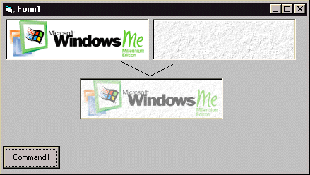



## Combine 2 Graphics\! Great for adding TEXTURES to images\. See ScreenShot

### Description

Combine 2 Images. See Screenshot
 
### More Info
 

             |
---                |---
**Submitted On**   |2000-10-11 11:00:54
**By**             |[Sparq](https://github.com/Planet-Source-Code/PSCIndex/blob/master/ByAuthor/sparq.md)
**Level**          |Intermediate
**User Rating**    |4.0 (28 globes from 7 users)
**Compatibility**  |VB 6\.0
**Category**       |[Graphics](https://github.com/Planet-Source-Code/PSCIndex/blob/master/ByCategory/graphics__1-46.md)
**World**          |[Visual Basic](https://github.com/Planet-Source-Code/PSCIndex/blob/master/ByWorld/visual-basic.md)
**Archive File**   |[CODE\_UPLOAD1062810132000\.zip](https://github.com/Planet-Source-Code/sparq-combine-2-graphics-great-for-adding-textures-to-images-see-screenshot__1-12035/archive/master.zip)

